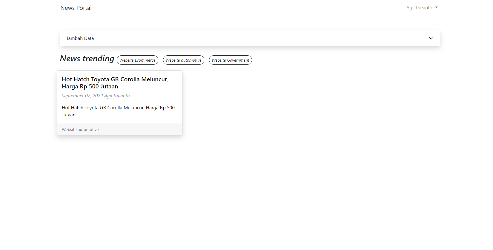

<p align="center"></p>

## Aplikasi News Portal 
NewsPortal merupakan suatu aplikasi berita berbasis website yang dimana terdapat fitur CRUD (Create , Read , Update , Delete) pada pengaplikasiaannya. Beberapa stack yang digunakan pada pembuatan aplikasi ini : LARAVEL 9 dan BOOTSTRAP 5 serta penggunaan MySQL untuk databasenya. 

## Setup Aplikasi News Portal
- Pertama, pastikan kalian sudah punya [PHP](https://php.net).
- Kedua, jangan lupa kalian sudah terinstall juga [Composer](https://getcomposer.org)
- Terakhir, pastikan kalian juga sudah punya database relasional seperti [MySQL](https://www.mysql.com/downloads/)

Unduh repository ke dalam komputer menggunakan perintah `git clone`. Url
repository dapat dilihat di dalam repository yang diinginkan.

```
git clone https://github.com/agil2406/newsportal.git
cd newsportal
composer install && composer update
```
Lanjut, copy file `.env.example` dengan nama `.env` sebagai berikut:
```
cp .env.example .env
```
Kemudian, silahkan ganti credentials database di file .env nya seperti:
```
DB_CONNECTION=mysql
DB_HOST=127.0.0.1
DB_PORT=3306
DB_DATABASE=newsportal
DB_USERNAME=root
DB_PASSWORD=
```

Kemudian, silahkan migrate semua database di project ini dan seeder data dengan menggunakan artisan command:
```
php artisan migrate --seed
```
Lalu mengaktifkan public storage untuk penyimpanan gambar menggunakan artisan command:
```
php artisan storage:link
```
Lanjut, generate aplikasi key untuk keamanan pada project laravel dengan menggunakan artisan command berikut:
```
php artisan key:generate
```
Langkah Terakhir, silahkan jalankan local development server Laravel dengan menggunakan artisan command sebagai berikut:
```
php artisan serve
```
Project ini akan berjalan di `https://localhost:8080` dan jangan lupa untuk menghidupkan `Apache` dan `MySQL` pada `Xampp` atau aplikasi yang kalian gunakan.

## Fitur apa saja yang tersedia ?
- Autentikasi Admin
- CRUD News
- Show News by Category
  
## Default Account for testing
**Admin Default Account 1**
- email: admin@gmail.com
- Password: 12345678
  
**Admin Default Account 2**
- email: dotindonesia@gmail.com
- Password: 12345678
---